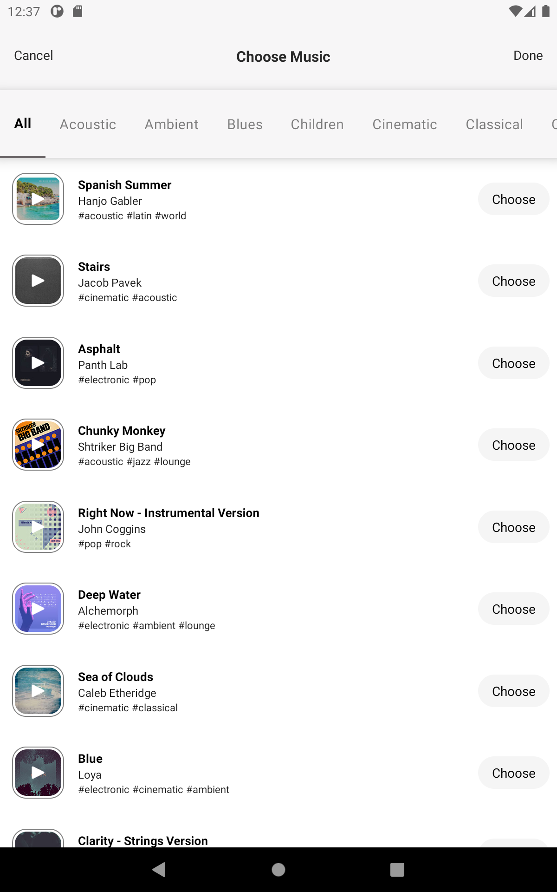
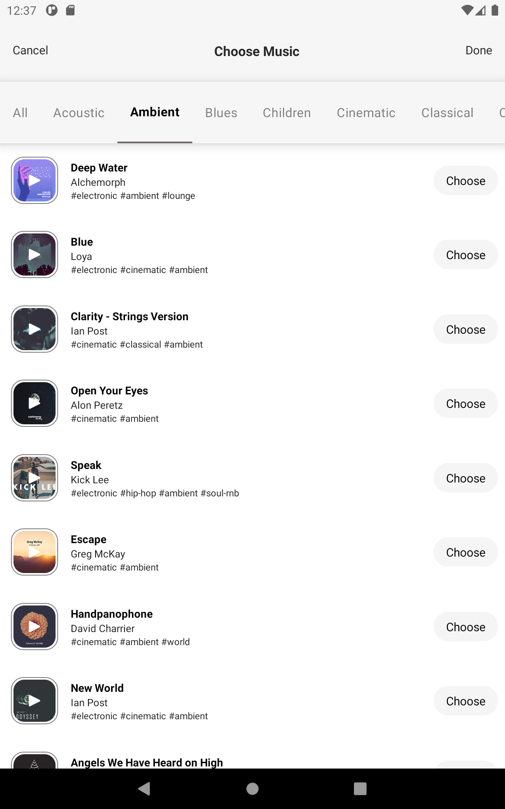
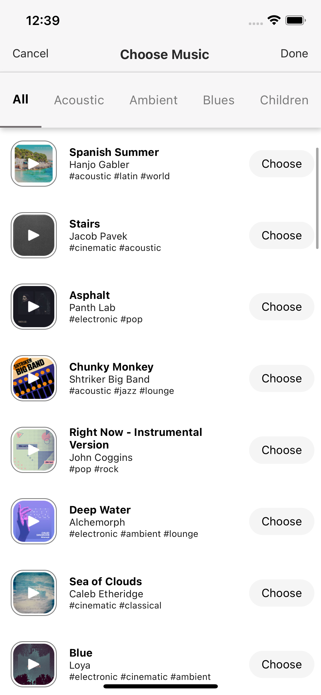
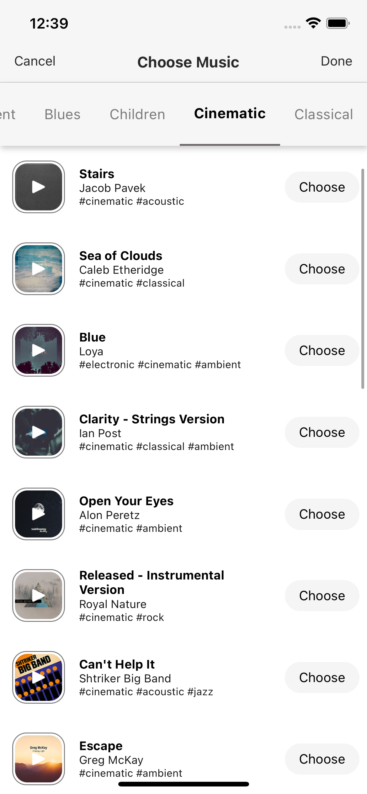
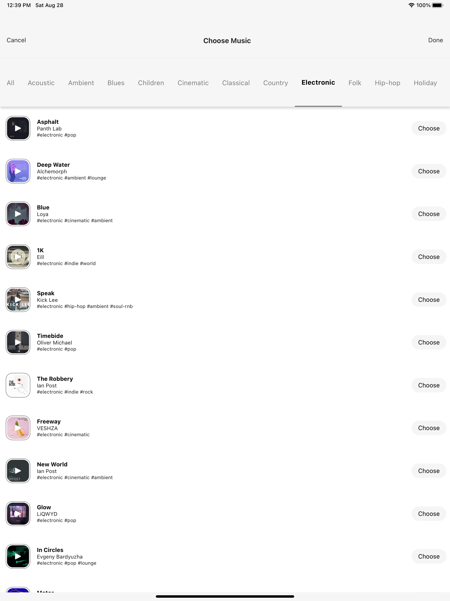

# Leoar_Musiclist

## Versions

Instructions on how to use them in your own application are linked below.

| Name | Version |
| ------ | ------ |
| React | 17.0.2 |
| React Native | 0.65.1 |
| Node | 14.15.4 |

# Used Library
- For fetch data internet:  axios | 0.21.1 |

## Installation

Requires [Node.js](https://nodejs.org/) v10+ to run.
Install the dependencies and devDependencies and start the server.

## For Android

First one : 
```sh
npm install
```

and then : 
```sh
npm run android
```

## For IOS

First one : 
```sh
npm install
```

and then : 
```sh
cd ios
```

and then : 
```sh
pod install
```
and then : 
```sh
npm run ios
```

## Android Phone


## Android Tablet



## IOS Phone



## IOS Tablet


